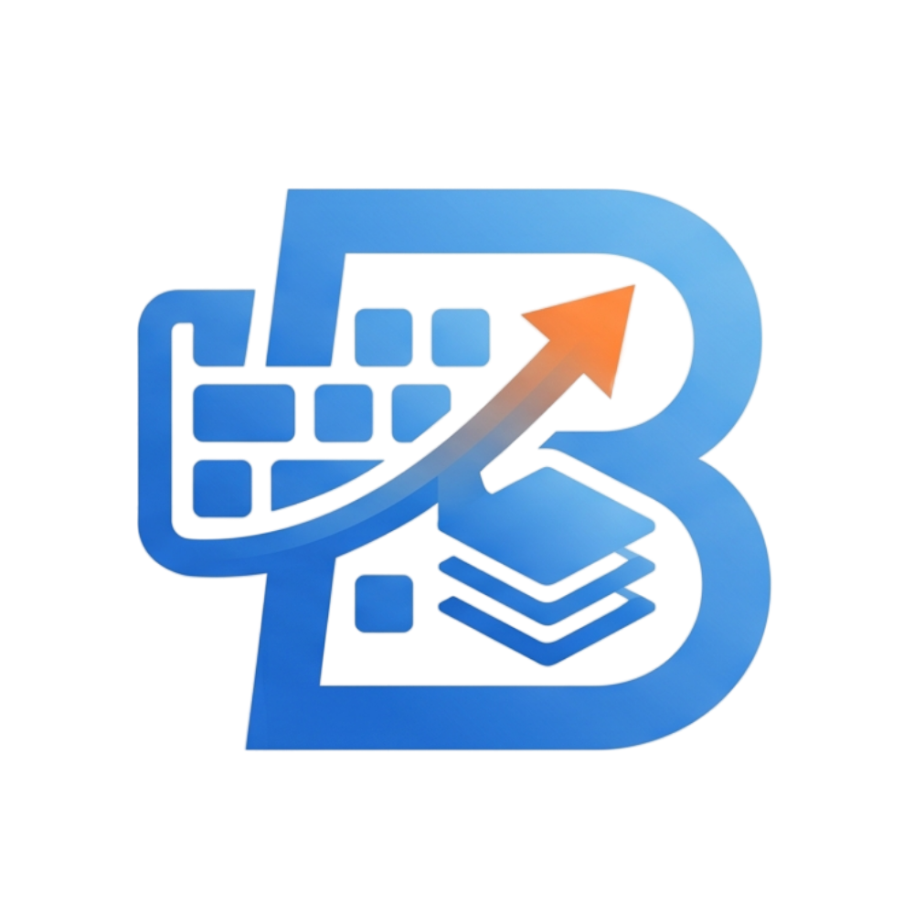

<p align="center">
  
</p>

<h1 align="center">Boarddy</h1>

<p align="center">
  <a href="LICENSE.md"></a>
  <a href="#installation"></a>
  <a href="#development--building"></a>
  <a href="#development--building"></a>
</p>

<p align="center">
  <b>The Input & Memory Layer for Your Computer.</b><br />
  Your clipboard remembers. Your keyboard learns.
</p>

Boarddy is a lightweight, local-first desktop application designed to supercharge your typing speed, automate repetitive entries, and capture your clipboard history seamlessly. It bridges the gap between your keyboard inputs and the operating system, creating a highly responsive and personalized productivity environment.

---

## ⚡ Explain Boarddy in 10 Seconds

Boarddy is **not just a clipboard manager**—it is a comprehensive **productivity layer** that runs locally on your computer. It combines **clipboard history**, **quick paste**, **autocomplete**, **autocorrect**, a **personal dictionary**, and **custom keyboard gestures** into one unified, offline-first interface. Built using **Tauri** and **Rust**, it uses minimal system resources while offering instant global access.

---

## 💎 Why Boarddy? (The 30-Second Value Proposition)

Every day, you lose hours to repetitive typing, searching for previously copied text, correcting typos, and navigating text with arrow keys. Boarddy solves this by:

1. **Eliminating Clipboard Loss**: Every text snippet, link, code block, or image you copy is instantly indexed and searchable.
2. **Accelerating Your Typing**: Boarddy's predictive autocomplete engine learns from your vocabulary context in real-time, offering instant inline suggestions.
3. **Optimizing Keyboard Navigation**: With custom keyboard gestures, you can navigate, edit, and delete text without ever leaving the home row.
4. **Keeping Data Private**: 100% of your data remains on your local machine. No external servers, no cloud leakage.

---

## 🌟 Key Features

### 📋 Clipboard Memory & Quick Paste
* **Smart Clipboard History**: Keep track of everything you copy. Content is classified by type (URLs, email addresses, color hex codes, images, and code snippets) for quick filtering.
* **Instant Summoning**: Press `Ctrl+Shift+V` or double-tap `Shift` to bring up the Quick Paste overlay right at your cursor position.
* **Favorites & Pinning**: Pin frequently used text fragments or canned responses for quick access anytime.

### ✍️ Intelligent Typing Assistant
* **Predictive Key Selection (PKS)**: The local engine predicts your next keys based on vocabulary context, significantly reducing keypress errors.
* **Floating Autocomplete**: Seamlessly view and select suggestions as you type. Navigate autocomplete suggestions instantly using keyboard shortcuts (number/letter selection).
* **Personal Dictionary & Autocorrect**: Save custom shorthand, abbreviations, and industry terms. Boarddy ranks suggestions adaptively based on your usage frequency.

### ⌨️ Keyboard Gesture Engine
* **Micro-Navigation**: Move your cursor character-by-character or word-by-word with intuitive keyboard shortcuts (e.g., `Space` + arrow keys) directly on the home row.
* **Directional & Line Deletion**: Delete words or whole lines instantly (e.g., `Backspace` + `Left Arrow` to delete the previous word, `Backspace` + `Up Arrow` to clear the current line).

### 🛠️ Developer Productivity Mode
* **Code Snippet Quick Paste**: Store and insert reusable snippets of code with syntax formatting.
* **Command Expansion**: Map short triggers to complex command sequences or boilerplates.

---

## 📦 Installation

Boarddy can be installed via your favorite platform package manager or downloaded directly from the official releases page.

### Windows
```bash
# Install via Winget
winget install Boarddy

# Or download the installer (.msi) or Portable Executable (.exe) from Releases
```

### macOS
```bash
# Install via Homebrew
brew install --cask boarddy

# Available for both Apple Silicon (M-series) and Intel architectures.
```

### Linux
```bash
# Install via Scoop, or grab the AppImage/Deb/RPM packages from Releases
scoop install boarddy
```

> **Note**: The package manager commands will become active upon public package registry indexing. For direct downloads, please visit the [Releases](https://github.com/boarddy-io/boarddy/releases) page.

---

## 🛠️ Development & Building

If you wish to inspect or compile Boarddy locally, follow the steps below.

### Prerequisites
* **Node.js** (v18 or higher)
* **Rust & Cargo** (v1.75 or higher)
* **Visual Studio C++ Build Tools** (Required for Windows development)

### 1. Clone the Repository
```bash
git clone https://github.com/boarddy-io/boarddy.git
cd boarddy
```

### 2. Install Dependencies
```bash
npm install
```

### 3. Run in Development Mode
```bash
npm run tauri dev
```

### 4. Build Production Binaries
To build optimized, standalone installers for your current platform:
```bash
npm run tauri build
```

---

## 🗺️ Roadmap & Future Vision

We are actively expanding the Boarddy productivity ecosystem. Here is what is planned:
* [ ] **Local LLM Integration**: Privacy-preserving, local AI completion and smart dictionary expansions.
* [ ] **Custom scripting engine**: Write JavaScript or Python hooks to process clipboard content on the fly.
* [ ] **Cross-Device Sync (End-to-End Encrypted)**: Peer-to-peer encrypted sync for users operating multiple local machines.
* [ ] **Expanded Shell Integrations**: Deep integrations with terminal environments and text editors.

---

## ⚖️ License & Terms

Boarddy is commercial software owned by **Huna Inc.** and is **not open source**. 

By accessing or cloning this repository, you agree to the terms in the [LICENSE.md](LICENSE.md) file:
* All rights reserved.
* You may not copy, modify, redistribute, sublicense, or create derivative works from this codebase without explicit written authorization from Huna Inc.
* Public access to this repository does not grant any commercial or non-commercial usage rights.

For inquiries, enterprise licensing, or support requests, reach out at [licensing@huna.io](mailto:licensing@huna.io).
